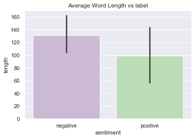
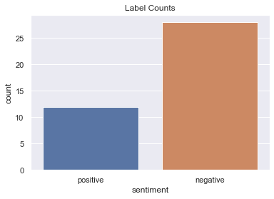
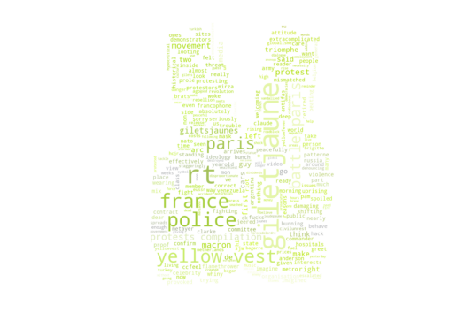
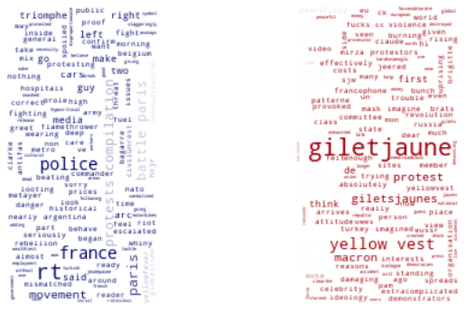
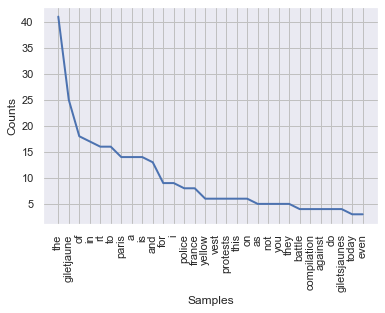
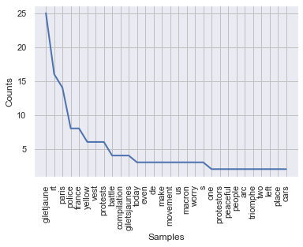

<h1 > Amri Nader  </h1> 

<h2> Library importation <h2> 


```python
import numpy as np
import pandas as pd
import seaborn as sns
import matplotlib.pyplot as plt
sns.set(color_codes=True)
from wordcloud import WordCloud, STOPWORDS, ImageColorGenerator
```


```python
stopwords = set(STOPWORDS)
```

<h2> Load the Data </h2>


```python
df = pd.read_csv("giletjaune.csv", delimiter = ',',encoding = "ISO-8859-1",names=None)
df.head()
```


<div>
<style scoped>
    .dataframe tbody tr th:only-of-type {
        vertical-align: middle;
    }

    .dataframe tbody tr th {
        vertical-align: top;
    }

    .dataframe thead th {
        text-align: right;
    }
</style>
<table border="1" class="dataframe">
  <thead>
    <tr style="text-align: right;">
      <th></th>
      <th>Date_Time</th>
      <th>Twitter_handle</th>
      <th>Pleasure</th>
      <th>Arousal</th>
      <th>Tweet</th>
      <th>sentiment</th>
    </tr>
  </thead>
  <tbody>
    <tr>
      <td>0</td>
      <td>12-03-18 07:30,10thCrusader,5.64,4.64,"By the ...</td>
      <td>NaN</td>
      <td>NaN</td>
      <td>NaN</td>
      <td>NaN</td>
      <td>NaN</td>
    </tr>
    <tr>
      <td>1</td>
      <td>12-01-18 18:46,AhmedTarekMokh1,6.52,4.30,"RT @...</td>
      <td>NaN</td>
      <td>NaN</td>
      <td>NaN</td>
      <td>NaN</td>
      <td>NaN</td>
    </tr>
    <tr>
      <td>2</td>
      <td>12-02-18 00:46,AlfArthur8,6.47,4.42,@GuyVerhof...</td>
      <td>NaN</td>
      <td>NaN</td>
      <td>NaN</td>
      <td>NaN</td>
      <td>NaN</td>
    </tr>
    <tr>
      <td>3</td>
      <td>12-03-18 23:20,alicnsuna,5.24,5.52,RT @joepenn...</td>
      <td>NaN</td>
      <td>NaN</td>
      <td>NaN</td>
      <td>NaN</td>
      <td>NaN</td>
    </tr>
    <tr>
      <td>4</td>
      <td>12-04-18 01:06,alown6666,5.60,4.14,"@RusoAzul ...</td>
      <td>NaN</td>
      <td>NaN</td>
      <td>NaN</td>
      <td>NaN</td>
      <td>NaN</td>
    </tr>
  </tbody>
</table>
</div>


the data is not clean nor orgnised there is some work to to lets start by removing the ; and orgnising the coloms  __


```python
df=df.Date_Time.apply(lambda x: x.replace('"',''))
```


```python
df=df.apply(lambda x: x.replace(';',''))
```


```python
df
```


    0     12-03-18 07:30,10thCrusader,5.64,4.64,By the t...
    1     12-01-18 18:46,AhmedTarekMokh1,6.52,4.30,RT @K...
    2     12-02-18 00:46,AlfArthur8,6.47,4.42,@GuyVerhof...
    3     12-03-18 23:20,alicnsuna,5.24,5.52,RT @joepenn...
    4     12-04-18 01:06,alown6666,5.60,4.14,@RusoAzul I...
    5     12-03-18 07:53,andrew_ed_ba,5.83,3.86,As part ...
    6     12-04-18 11:07,Viva la @EmmanuelMacron indeed....
    7     12-04-18 02:54,Antibullshit12,5.07,4.54,RT @An...
    8     12-04-18 02:54,Antibullshit12,5.07,4.54,RT @An...
    9     12-02-18 17:31,AxelHuynh,4.69,4.45,TODAY, A SY...
    10    12-02-18 06:07,IT’S SO SAD & REVOLTING! DONâ...
    11    12-02-18 06:56,bizcom,6.37,4.22,Hi @NATO could...
    12    12-03-18 04:49,bursuk,5.07,4.54,RT @TickT0Tack...
    13    12-03-18 01:18,CarstenGerhardt,6.01,4.08,Powef...
    14    12-03-18 14:23,cdeysson,5.55,4.91,The point of...
    15    12-03-18 22:37,charmgritty,6.29,4.75,Imagine a...
    16    12-04-18 05:35,clinicalwstmn,5.09,5.21,@Doctor...
    17    12-03-18 09:13,DelightOxygen,5.96,4.55,Also th...
    18    12-02-18 17:12,DickyDido3,5.81,4.68,@allan_cla...
    19    12-02-18 17:07,Let me ask you a question: what...
    20    12-03-18 23:43,dominic_putney,5.12,3.97,@Micha...
    21    12-02-18 01:26,donnypongo,5.10,4.93,RT @EHSANI...
    22    12-02-18 08:07,“I came peacefully, but even ...
    23    12-03-18 09:20,duyquykaka,4.38,5.00,I liked a ...
    24    12-01-18 16:55,e_connaisseur,5.70,3.23,#WorldA...
    25    12-01-18 20:46,edith_fr,5.79,4.20,RT @HeloiseP...
    26    12-03-18 20:20,elephantsshoes,5.65,4.29,RT @Gh...
    27    12-04-18 03:57,feliks712,5.71,5.44,RT @Unjum_M...
    28    12-02-18 15:19,FiatPalioHLX,5.74,4.35,RT @Stra...
    29    12-01-18 19:18,GadaldiGiovanni,4.87,4.97,Guys ...
    30    12-03-18 06:39,Ghrissiha,5.30,4.71,Is it a spo...
    31     12-02-18 10:07,Is #France a prelude to major ...
    32    12-02-18 20:01,GingerMcFall,5.81,3.73,RT @Brun...
    33    12-02-18 19:07,Une centaine de gilets jaunes e...
    34    12-01-18 20:27,GingerMcFall,6.30,3.52,RT @Blac...
    35    12-02-18 16:19,„Macron’s new levies on fos...
    36    12-03-18 18:51,harrycliffjr,5.08,5.71,RT @harr...
    37    12-03-18 23:44,hilalgulumcan,6.03,4.20,RT @mar...
    38    12-01-18 22:33,humanbird19,6.03,4.46,Our polic...
    39    12-01-18 20:11,hw_renewe,5.99,4.44,When Macron...
    40    12-02-18 23:00,ibonnetb,5.38,4.29,About 100,00...
    41    12-03-18 00:56,ikbenbezorgd,3.94,3.70,RT @Dwal...
    42    12-02-18 03:58,j_amorfati,5.07,4.54,RT @Antibu...
    43    12-03-18 02:32,Jabato111111,5.22,4.63,RT @Clim...
    44    12-01-18 17:36,jamesinparis,5.65,5.14,This guy...
    45    12-02-18 13:34,javibrantiuk,3.33,4.18,One Dead...
    46    12-02-18 02:27,JJDreau,6.52,5.46,Instant #karm...
    47    12-02-18 17:22,johndunet,6.13,3.33,@KatieMcCoy...
    48    12-02-18 10:25,Johnfrededdy,6.74,5.42,RT @Slig...
    49    12-04-18 03:33,jotahal,5.42,4.97,RT @r_karahas...
    50    12-04-18 03:33,#ViveLaDémocratieFrancaises ðŸ...
    Name: Date_Time, dtype: object


<h2> Reorgnising the dataset </h2>

we only need the tweets and the sentiment so lets removee any excess informtion 


```python
t=df.str.replace('\d+', '')
t=t.str.replace('-', '')
#t=t.str.replace(':', '')
t=t.str.replace('.', '')
#t=t.str.replace(',', '')
t
```


    0      :,thCrusader,,,By the time Petit Macron gets ...
    1      :,AhmedTarekMokh,,,RT @Keziadventure: Quick v...
    2      :,AlfArthur,,,@GuyVerhoftwat Good time for @M...
    3      :,alicnsuna,,,RT @joepenney: #GiletJaune prot...
    4      :,alown,,,@RusoAzul It was more like a contra...
    5      :,andrew_ed_ba,,,As part francophone, way to ...
    6             :,Viva la @EmmanuelMacron indeed,Positive
    7      :,Antibullshit,,,RT @Antibullshit: / The Batt...
    8      :,Antibullshit,,,RT @Antibullshit: / The Batt...
    9      :,AxelHuynh,,,TODAY, A SYMBOL OF REPUBLIC & F...
    10     :,IT’S SO SAD & REVOLTING! DON’T LET IGNO...
    11     :,bizcom,,,Hi @NATO could you confirm this gu...
    12     :,bursuk,,,RT @TickTTack: / The Battle For Pa...
    13     :,CarstenGerhardt,,,Poweful stuff going on in...
    14     :,cdeysson,,,The point of the gilet jaune i...
    15     :,charmgritty,,,Imagine a world, dear reader,...
    16     :,clinicalwstmn,,,@DoctorKropotkin @BethLynch...
    17     :,DelightOxygen,,,Also the antifas on this vi...
    18     :,DickyDido,,,@allan_clarke_ @SouriaSyrians C...
    19     :,Let me ask you a question: what are they 'p...
    20     :,dominic_putney,,,@Michael_Heaver The contin...
    21     :,donnypongo,,,RT @EHSANI: Many demonstrators...
    22     :,“I came peacefully, but even I’m ready ...
    23     :,duyquykaka,,,I liked a @YouTube video https...
    24     :,e_connaisseur,,,#WorldAIDSDay #AIDS #ActUp ...
    25     :,edith_fr,,,RT @HeloisePatricia: I almost fe...
    26     :,elephantsshoes,,,RT @Ghrissiha: € If ther...
    27     :,feliks,,,RT @Unjum_Mirza: #Metro this morni...
    28     :,FiatPalioHLX,,,RT @StrategicNews: I do not ...
    29     :,GadaldiGiovanni,,,Guys don’t worry while ...
    30     :,Ghrissiha,,,Is it a spontaneous popular mov...
    31      :,Is #France a prelude to major changes? Is ...
    32     :,GingerMcFall,,,RT @BrunoBoelpaep: About a h...
    33     :,Une centaine de gilets jaunes en route de C...
    34     :,GingerMcFall,,,RT @Blackblocfr: Follow us o...
    35     :,„Macron’s new levies on fossil fuels, [...
    36     :,harrycliffjr,,,RT @harrycliffjr: YELLOWFEVE...
    37     :,hilalgulumcan,,,RT @marklowen: #Turkey’s ...
    38     :,humanbird,,,Our police our swats are exhaus...
    39     :,hw_renewe,,,When Macron disembarked from hi...
    40     :,ibonnetb,,,About , “Gilets jaunes” prot...
    41     :,ikbenbezorgd,,,RT @Dwalingen: It is clearTh...
    42     :,j_amorfati,,,RT @Antibullshit: The Battle F...
    43     :,Jabato,,,RT @ClimatismBlog: AWW no good! #J...
    44     :,jamesinparis,,,This guy is too ridiculous f...
    45     :,javibrantiuk,,,One Dead Following Accident ...
    46     :,JJDreau,,,Instant #karma Justice immanente,...
    47     :,johndunet,,,@KatieMcCoy all eyes on us, don...
    48     :,Johnfrededdy,,,RT @Sligogirls: #giletjaune ...
    49     :,jotahal,,,RT @r_karahasanoglu: Where is the...
    50     :,#ViveLaDémocratieFrancaises 👊 https://t...
    Name: Date_Time, dtype: object


```python
len(t)
```


    51


<h6> removing the user id </h6>

to remove the user id we can skip the first "," :


```python
for i in range(len(t)) :
    t[i]=t[i].split(',', 1)[-1]
    t[i]=t[i].split(',', 1)[-1]

```


```python
t
```


    0     ,,By the time Petit Macron gets back to Paris,...
    1     ,,RT @Keziadventure: Quick visit to the #ArcDe...
    2     ,,@GuyVerhoftwat Good time for @MayorofLondon ...
    3     ,,RT @joepenney: #GiletJaune protestors beatin...
    4     ,,@RusoAzul It was more like a contract betwee...
    5     ,,As part francophone, way to make the #GiletJ...
    6                                              Positive
    7     ,,RT @Antibullshit: / The Battle For Paris! Ye...
    8     ,,RT @Antibullshit: / The Battle For Paris! Ye...
    9     ,,TODAY, A SYMBOL OF REPUBLIC & FREEDOM HAS BE...
    10                France https://tco/lzjuDdjVQ,Negative
    11    ,,Hi @NATO could you confirm this guy is membe...
    12    ,,RT @TickTTack: / The Battle For Paris! Yello...
    13    ,,Poweful stuff going on in France 😮 #Gilet...
    14    ,,The point of the gilet jaune is to ensure ...
    15    ,,Imagine a world, dear reader, where the most...
    16    ,,@DoctorKropotkin @BethLynch @VryKranky Misma...
    17    ,,Also the antifas on this video trying to hac...
    18    ,,@allan_clarke_ @SouriaSyrians C'mon, SJW, do...
    19                                              Neutral
    20    ,,@Michael_Heaver The continent is watching as...
    21    ,,RT @EHSANI: Many demonstrators in #Paris sai...
    22     but even I’m ready to fight given how I’v...
    23    ,,I liked a @YouTube video https://tco/klkRPKQ...
    24    ,,#WorldAIDSDay #AIDS #ActUp #Paris #PlaceDeLa...
    25    ,,RT @HeloisePatricia: I almost feel sorry for...
    26    ,,RT @Ghrissiha: € If there is no bread for ...
    27    ,,RT @Unjum_Mirza: #Metro this morning: #Franc...
    28    ,,RT @StrategicNews: I do not express my point...
    29    ,,Guys don’t worry while all the demonstrati...
    30    ,,Is it a spontaneous popular movement, or is ...
    31                                             Negative
    32    ,,RT @BrunoBoelpaep: About a hundred yellow ve...
    33                                              Neutral
    34    ,,RT @Blackblocfr: Follow us on Facebook #Gile...
    35     [] to cut emissions & to fund renewable energ...
    36    ,,RT @harrycliffjr: YELLOWFEVER? #music :HCJR ...
    37    ,,RT @marklowen: #Turkey’s @MFATurkey issues...
    38    ,,Our police our swats are exhausted  hours wi...
    39    ,,When Macron disembarked from his jet, rather...
    40    ,,About , “Gilets jaunes” protested yester...
    41    ,,RT @Dwalingen: It is clearThe government is ...
    42    ,,RT @Antibullshit: The Battle For Paris! Yell...
    43    ,,RT @ClimatismBlog: AWW no good! #JeuDePaume ...
    44      ,,This guy is too ridiculous for words,Negative
    45    ,,One Dead Following Accident at 'Yellow Vest'...
    46          ,,Instant #karma Justice immanente,Positive
    47    ,,@KatieMcCoy all eyes on us, don't worry, we ...
    48    ,,RT @Sligogirls: #giletjaune Workers' no long...
    49    ,,RT @r_karahasanoglu: Where is the global med...
    50                                             Positive
    Name: Date_Time, dtype: object


Removing the numbers ! :


```python
import re
re.sub(r'@[A-Za-z0-9]+','',t[2])
```


    ',, Good time for  to run a TV ad campaign across Europe and USA on the virtues of London as a tourist destination Doubt Paris will be seeing many new Christmas bookings #giletjaune'


```python
t[2]
```


    ',,@GuyVerhoftwat Good time for @MayorofLondon to run a TV ad campaign across Europe and USA on the virtues of London as a tourist destination Doubt Paris will be seeing many new Christmas bookings #giletjaune'


### Defining data cleaning function

With above five data cleaning task, I will first define data cleaning function, and then will be applied to the whole dataset. Tokenization, stemming/lemmatization, stop words will be dealt with later stage when creating matrix with either count vectorizer or Tfidf vectorizer.


```python
from nltk.tokenize import WordPunctTokenizer
from bs4 import BeautifulSoup
tok = WordPunctTokenizer()
```


```python
pat1 = r'@[A-Za-z0-9]+'
pat2 = r'https?://[A-Za-z0-9./]+'
combined_pat = r'|'.join((pat1, pat2))

def tweet_cleaner(text):
    soup = BeautifulSoup(text, 'lxml')
    souped = soup.get_text()
    stripped = re.sub(combined_pat, '', souped)
    try:
        clean = stripped.decode("utf-8-sig").replace(u"\ufffd", "?")
    except:
        clean = stripped
    letters_only = re.sub("[^a-zA-Z]", " ", clean)
    lower_case = letters_only.lower()
    # During the letters_only process two lines above, it has created unnecessay white spaces,
    # I will tokenize and join together to remove unneccessary white spaces
    words = tok.tokenize(lower_case)
    return (" ".join(words)).strip()
```


```python
test_result = []
for k in range(len(t)):
    test_result.append(tweet_cleaner(t[k]))
```

__lets chek the data after removing the hashtag and the links and tags :__


```python
test_result
```


    ['by the time petit macron gets back to paris he ll be browning his trousers neutral',
     'rt quick visit to the arcdetriomphe today turned into an even quicker one huge police presence most giletjaune protestors seemed very peaceful lots of women young people and even dogs livecoverage bbcnews paris positive',
     'good time for to run a tv ad campaign across europe and usa on the virtues of london as a tourist destination doubt paris will be seeing many new christmas bookings giletjaune',
     'rt giletjaune protestors beating police out of the arc de triomphe in paris negative',
     'it was more like a contract between the two side police left their mask and giletjaune left the place negative',
     'as part francophone way to make the giletjaune movement look like a bunch of whiny and spoiled brats by not only burning and looting cars and hospitals but also effectively damaging historical sites negative',
     'positive',
     'rt the battle for paris yellow vest protests compilation negative',
     'rt the battle for paris yellow vest protests compilation negative',
     'today a symbol of republic freedom has been stained positive',
     'france negative',
     'hi could you confirm this guy is member of your organisation and his attitude is correct against giletjaune that seriously make me think about nato patterne against russia cc com view negative',
     'rt the battle for paris yellow vest protests compilation negative',
     'poweful stuff going on in france giletjaune positive',
     'the point of the gilet jaune is to ensure its wearer is visible on the road and whatever the outcome of this conflict the gilets jaunes have won in terms of what really counts the war of cultural representation giletjaune positive',
     'imagine a world dear reader where the most woke celebrity take from the giletjaune uprising is from pam anderson negative',
     'mismatched shifting class interests in against non state violence right now are extracomplicated for these reasons prole flamethrower threat inside paris owes nearly nothing to giletjaune ideology such as that is is imagined negative',
     'also the antifas on this video trying to hack the movement when in the first time they said us to go f ck ourselves because they do not want to be mix with the right proof that they absolutely do not care about the people could go in venezuela negative',
     'clarke c mon sjw do you really think these giletjaune fucks are standing around peacefully protesting negative',
     'neutral',
     'heaver the continent is watching as destroys his country vive le giletjaune giletsjaune positive',
     'rt many demonstrators in paris said they felt the police provoked much of the fighting negative',
     'but even i m ready to fight given how i ve seen the riot police behave claude metayer a yearold retired army commander giletjaune negative',
     'i liked a video gilets jaunes pollution vs chaton giletsjaune giletjaune neutral',
     'worldaidsday aids actup paris placedelaconcorde obelisk egyptian color has always been a thing with paris today we have giletjaune yellowvest place de la concorde positive',
     'rt i almost feel sorry for him macron arrives in argentina no welcoming committee and the first person to greet him is wearing a yellow vest giletjaune negative',
     'rt if there is no bread for the poor let them eat cookies posistive',
     'rt mirza metro this morning france macron in deep trouble jeered by public as giletjaune yellowvest rebellion spreads to netherlands and belgium the movement began two weeks ago over high fuel prices but has escalated into a general protest against rising living costs negative',
     'rt i do not express my point of view on twitter although i support the commendable cause of giletjaune i find it more than shameful to tag the arcdetriomphepeople who have done this should be ashamed of them you make us shame paris positive',
     'guys don t worry while all the demonstrations were happening in paris i was drinking wine in the louvre i hate for you to worry for me giletjaune positive',
     'is it a spontaneous popular movement or is it a transient crisis because of mr macron s policies neutral',
     'negative',
     'rt about a hundred yellow vests at congres heading to brussels central station neutral',
     'neutral',
     'rt follow us on facebook giletjaune gilestjaunes blackbloc paris neutral',
     'to cut emissions to fund renewable energy projects triggered riots neutral',
     'rt yellowfever music hcjr macron giletjaune giletsjaunes paris france revolution danger emanuelmacron brigitte g eu un bagarre civilunrest enough globalisme eussr negative',
     'rt turkey s issues a staggeringly hypocritical press release denouncing disproportionate use of force by france s police in giletjaune protests adding we believe in the necessity of dialogue in democracies a reminder of how turkish police tackle peaceful protests negative',
     'our police our swats are exhausted hours without a break i guess they will soon wear a giletjaune to wake up all the money going as dividends to the wealthiest forcesdelordre need help to negative',
     'when macron disembarked from his jet rather than being met w a sea of diplomats a fully uniformed military band he instead shook hands with what appeared to be an airport security guard wearing a distinct yellow hivisibility yellow vest giletjaune neutral',
     'about gilets jaunes protested yesterday in france cars and motorbikes were destroyed stores vandalized and the arc de triomphe stormed the statue of marianne the symbol of the french republic was smashed giletjaune giletsjaunes france paris negative',
     'rt it is clearthe government is our enemy negative',
     'rt the battle for paris yellow vest protests compilation negative',
     'rt aww no good jeudepaume on fire negative',
     'this guy is too ridiculous for words negative',
     'one dead following accident at yellow vest roadblock in s france giletjaune giletsjaunes prosecutor v a negative',
     'instant karma justice immanente positive',
     'all eyes on us don t worry we will not disappoint you yellowvests giletjaune giletsjaunes citizenrevolution positive',
     'rt giletjaune workers no longer live in areas where employment is created giving rise to a social and cultural shock negative',
     'rt karahasanoglu where is the global media national media and the european union giletjaune anonops negative',
     'positive']


#### we ll extract the tweets and the sentiement apart :


```python
sentiment = []
tweets = []
for i in range(len(test_result)):
    sentiment.append(test_result[i][-8:])
    tweets.append(test_result[i][:-8])
```


```python
tweets
```


    ['by the time petit macron gets back to paris he ll be browning his trousers',
     'rt quick visit to the arcdetriomphe today turned into an even quicker one huge police presence most giletjaune protestors seemed very peaceful lots of women young people and even dogs livecoverage bbcnews paris ',
     'good time for to run a tv ad campaign across europe and usa on the virtues of london as a tourist destination doubt paris will be seeing many new christmas bookings gi',
     'rt giletjaune protestors beating police out of the arc de triomphe in paris ',
     'it was more like a contract between the two side police left their mask and giletjaune left the place ',
     'as part francophone way to make the giletjaune movement look like a bunch of whiny and spoiled brats by not only burning and looting cars and hospitals but also effectively damaging historical sites ',
     '',
     'rt the battle for paris yellow vest protests compilation ',
     'rt the battle for paris yellow vest protests compilation ',
     'today a symbol of republic freedom has been stained ',
     'france ',
     'hi could you confirm this guy is member of your organisation and his attitude is correct against giletjaune that seriously make me think about nato patterne against russia cc com view ',
     'rt the battle for paris yellow vest protests compilation ',
     'poweful stuff going on in france giletjaune ',
     'the point of the gilet jaune is to ensure its wearer is visible on the road and whatever the outcome of this conflict the gilets jaunes have won in terms of what really counts the war of cultural representation giletjaune ',
     'imagine a world dear reader where the most woke celebrity take from the giletjaune uprising is from pam anderson ',
     'mismatched shifting class interests in against non state violence right now are extracomplicated for these reasons prole flamethrower threat inside paris owes nearly nothing to giletjaune ideology such as that is is imagined ',
     'also the antifas on this video trying to hack the movement when in the first time they said us to go f ck ourselves because they do not want to be mix with the right proof that they absolutely do not care about the people could go in venezuela ',
     'clarke c mon sjw do you really think these giletjaune fucks are standing around peacefully protesting ',
     '',
     'heaver the continent is watching as destroys his country vive le giletjaune giletsjaune ',
     'rt many demonstrators in paris said they felt the police provoked much of the fighting ',
     'but even i m ready to fight given how i ve seen the riot police behave claude metayer a yearold retired army commander giletjaune ',
     'i liked a video gilets jaunes pollution vs chaton giletsjaune giletjaune',
     'worldaidsday aids actup paris placedelaconcorde obelisk egyptian color has always been a thing with paris today we have giletjaune yellowvest place de la concorde ',
     'rt i almost feel sorry for him macron arrives in argentina no welcoming committee and the first person to greet him is wearing a yellow vest giletjaune ',
     'rt if there is no bread for the poor let them eat cookies p',
     'rt mirza metro this morning france macron in deep trouble jeered by public as giletjaune yellowvest rebellion spreads to netherlands and belgium the movement began two weeks ago over high fuel prices but has escalated into a general protest against rising living costs ',
     'rt i do not express my point of view on twitter although i support the commendable cause of giletjaune i find it more than shameful to tag the arcdetriomphepeople who have done this should be ashamed of them you make us shame paris ',
     'guys don t worry while all the demonstrations were happening in paris i was drinking wine in the louvre i hate for you to worry for me giletjaune ',
     'is it a spontaneous popular movement or is it a transient crisis because of mr macron s policies',
     '',
     'rt about a hundred yellow vests at congres heading to brussels central station',
     '',
     'rt follow us on facebook giletjaune gilestjaunes blackbloc paris',
     'to cut emissions to fund renewable energy projects triggered riots',
     'rt yellowfever music hcjr macron giletjaune giletsjaunes paris france revolution danger emanuelmacron brigitte g eu un bagarre civilunrest enough globalisme eussr ',
     'rt turkey s issues a staggeringly hypocritical press release denouncing disproportionate use of force by france s police in giletjaune protests adding we believe in the necessity of dialogue in democracies a reminder of how turkish police tackle peaceful protests ',
     'our police our swats are exhausted hours without a break i guess they will soon wear a giletjaune to wake up all the money going as dividends to the wealthiest forcesdelordre need help to ',
     'when macron disembarked from his jet rather than being met w a sea of diplomats a fully uniformed military band he instead shook hands with what appeared to be an airport security guard wearing a distinct yellow hivisibility yellow vest giletjaune',
     'about gilets jaunes protested yesterday in france cars and motorbikes were destroyed stores vandalized and the arc de triomphe stormed the statue of marianne the symbol of the french republic was smashed giletjaune giletsjaunes france paris ',
     'rt it is clearthe government is our enemy ',
     'rt the battle for paris yellow vest protests compilation ',
     'rt aww no good jeudepaume on fire ',
     'this guy is too ridiculous for words ',
     'one dead following accident at yellow vest roadblock in s france giletjaune giletsjaunes prosecutor v a ',
     'instant karma justice immanente ',
     'all eyes on us don t worry we will not disappoint you yellowvests giletjaune giletsjaunes citizenrevolution ',
     'rt giletjaune workers no longer live in areas where employment is created giving rise to a social and cultural shock ',
     'rt karahasanoglu where is the global media national media and the european union giletjaune anonops ',
     '']


```python
data_clean = pd.DataFrame({'tweets':tweets})
data_clean['sentiment']=sentiment
datatest=data_clean
data_clean.head()
```


<div>
<style scoped>
    .dataframe tbody tr th:only-of-type {
        vertical-align: middle;
    }

    .dataframe tbody tr th {
        vertical-align: top;
    }

    .dataframe thead th {
        text-align: right;
    }
</style>
<table border="1" class="dataframe">
  <thead>
    <tr style="text-align: right;">
      <th></th>
      <th>tweets</th>
      <th>sentiment</th>
    </tr>
  </thead>
  <tbody>
    <tr>
      <td>0</td>
      <td>by the time petit macron gets back to paris he...</td>
      <td>neutral</td>
    </tr>
    <tr>
      <td>1</td>
      <td>rt quick visit to the arcdetriomphe today turn...</td>
      <td>positive</td>
    </tr>
    <tr>
      <td>2</td>
      <td>good time for to run a tv ad campaign across e...</td>
      <td>letjaune</td>
    </tr>
    <tr>
      <td>3</td>
      <td>rt giletjaune protestors beating police out of...</td>
      <td>negative</td>
    </tr>
    <tr>
      <td>4</td>
      <td>it was more like a contract between the two si...</td>
      <td>negative</td>
    </tr>
  </tbody>
</table>
</div>


<h3> Removing neutral tweets </h3>


```python
data_clean=data_clean[data_clean['sentiment'].str.contains("positive|negative")]
```


```python
data_clean.head(3)
```


<div>
<style scoped>
    .dataframe tbody tr th:only-of-type {
        vertical-align: middle;
    }

    .dataframe tbody tr th {
        vertical-align: top;
    }

    .dataframe thead th {
        text-align: right;
    }
</style>
<table border="1" class="dataframe">
  <thead>
    <tr style="text-align: right;">
      <th></th>
      <th>tweets</th>
      <th>sentiment</th>
    </tr>
  </thead>
  <tbody>
    <tr>
      <td>1</td>
      <td>rt quick visit to the arcdetriomphe today turn...</td>
      <td>positive</td>
    </tr>
    <tr>
      <td>3</td>
      <td>rt giletjaune protestors beating police out of...</td>
      <td>negative</td>
    </tr>
    <tr>
      <td>4</td>
      <td>it was more like a contract between the two si...</td>
      <td>negative</td>
    </tr>
  </tbody>
</table>
</div>


<h2> Train test split </h2>


```python
from sklearn.model_selection import train_test_split
```


```python
X_train, X_test, y_train, y_test = train_test_split(data_clean['tweets'], data_clean['sentiment'], test_size=0.10)
train_tweets = pd.DataFrame()
```


```python
train_tweets['length'] = X_train.apply(len)
train_tweets['sentiment'] = y_train
fig1 = sns.barplot('sentiment','length',data = train_tweets,palette='PRGn')
plt.title('Average Word Length vs label')
plot = fig1.get_figure()
plot.savefig('Barplot.png')
```





```python
fig2 = sns.countplot(x= 'sentiment',data = data_clean)
plt.title('Label Counts')
plot = fig2.get_figure()
plot.savefig('Count Plot.png')
```





<h3> Postive / Negative tweet separation </h3>


```python
positive = data_clean[data_clean['sentiment'].str.contains("positive")]
```


```python
positive.head(3)
```


<div>
<style scoped>
    .dataframe tbody tr th:only-of-type {
        vertical-align: middle;
    }

    .dataframe tbody tr th {
        vertical-align: top;
    }

    .dataframe thead th {
        text-align: right;
    }
</style>
<table border="1" class="dataframe">
  <thead>
    <tr style="text-align: right;">
      <th></th>
      <th>tweets</th>
      <th>sentiment</th>
    </tr>
  </thead>
  <tbody>
    <tr>
      <td>1</td>
      <td>rt quick visit to the arcdetriomphe today turn...</td>
      <td>positive</td>
    </tr>
    <tr>
      <td>6</td>
      <td></td>
      <td>positive</td>
    </tr>
    <tr>
      <td>9</td>
      <td>today a symbol of republic freedom has been st...</td>
      <td>positive</td>
    </tr>
  </tbody>
</table>
</div>


```python
negative = data_clean[data_clean['sentiment'].str.contains("negative")]
```


```python
negative.head(3)
```


<div>
<style scoped>
    .dataframe tbody tr th:only-of-type {
        vertical-align: middle;
    }

    .dataframe tbody tr th {
        vertical-align: top;
    }

    .dataframe thead th {
        text-align: right;
    }
</style>
<table border="1" class="dataframe">
  <thead>
    <tr style="text-align: right;">
      <th></th>
      <th>tweets</th>
      <th>sentiment</th>
    </tr>
  </thead>
  <tbody>
    <tr>
      <td>3</td>
      <td>rt giletjaune protestors beating police out of...</td>
      <td>negative</td>
    </tr>
    <tr>
      <td>4</td>
      <td>it was more like a contract between the two si...</td>
      <td>negative</td>
    </tr>
    <tr>
      <td>5</td>
      <td>as part francophone way to make the giletjaune...</td>
      <td>negative</td>
    </tr>
  </tbody>
</table>
</div>


<h3> Word cloud </h3>


```python
from os import path
from PIL import Image
from wordcloud import WordCloud, STOPWORDS, ImageColorGenerator

import matplotlib.pyplot as plt

```


```python
text_all = " ".join(review for review in data_clean.tweets)
print ("There are {} words in the combination of the tweets.".format(len(text_all)))
```

    There are 4745 words in the combination of all review.
    


```python
text_postive = " ".join(review for review in positive.tweets)
print ("There are {} words in the combination of positive tweets.".format(len(text_postive)))
```

    There are 1309 words in the combination of all tweets.
    


```python
text_postive = " ".join(review for review in negative.tweets)
print ("There are {} words in the combination of negative tweets.".format(len(text_postive)))
```

    There are 3435 words in the combination of negative tweets.
    


```python
mask = np.array(Image.open("gilet-jauuuune-1.jpg"))
wordcloud_fra = WordCloud(stopwords=stopwords, background_color="white", mode="RGBA", max_words=1000, mask=mask).generate(text_postive)

# create coloring from image
image_colors = ImageColorGenerator(mask)
plt.figure(figsize=[9,9])
plt.imshow(wordcloud_fra.recolor(color_func=image_colors), interpolation="bilinear")
plt.axis("off")

# store to file
plt.savefig("fra.png", format="png")

#plt.show()
```





__for the positve words wecan see giltes jaune which indecate that the movement have a positive support some other wrods like freedome outcome young also appear which indacte that the movment reprsent freedome and led by the youngs__


```python
text_negative = " ".join(review for review in negative.tweets)
print ("There are {} words in the combination of all review.".format(len(text_negative)))
```

    There are 3435 words in the combination of all review.
    


```python
mask = np.array(Image.open("682-004-5AC19A71.jpg"))
wordcloud_fra = WordCloud(stopwords=stopwords, background_color="white", mode="RGBA", max_words=1000, mask=mask).generate(text_negative)

# create coloring from image
image_colors = ImageColorGenerator(mask)
plt.figure(figsize=[9,9])
plt.imshow(wordcloud_fra.recolor(color_func=image_colors), interpolation="bilinear")
plt.axis("off")

# store to file
plt.savefig("fra.png", format="png")

#plt.show()
```





__for the negative wordcloud we can find police and macron this indicate that both of those parties have neegtive support on the net  we can alos some words that indcate voilance like fight and  threat__

Conclusion : 
the tweets that we have at our disposal are supportive for the movement and what it represent but at the same time they are against macron police and the vilance that is happening 

<h3> NLTK </h3>

#### Toknization 


```python
import nltk
nltk.download('punkt')
```

    [nltk_data] Downloading package punkt to
    [nltk_data]     C:\Users\NADER\AppData\Roaming\nltk_data...
    [nltk_data]   Package punkt is already up-to-date!
    


    True


```python
import nltk
from nltk.tokenize import sent_tokenize
text=text_all
tokenized_text=sent_tokenize(text)
print(tokenized_text)
```

    ['rt quick visit to the arcdetriomphe today turned into an even quicker one huge police presence most giletjaune protestors seemed very peaceful lots of women young people and even dogs livecoverage bbcnews paris  rt giletjaune protestors beating police out of the arc de triomphe in paris  it was more like a contract between the two side police left their mask and giletjaune left the place  as part francophone way to make the giletjaune movement look like a bunch of whiny and spoiled brats by not only burning and looting cars and hospitals but also effectively damaging historical sites   rt the battle for paris yellow vest protests compilation  rt the battle for paris yellow vest protests compilation  today a symbol of republic freedom has been stained  france  hi could you confirm this guy is member of your organisation and his attitude is correct against giletjaune that seriously make me think about nato patterne against russia cc com view  rt the battle for paris yellow vest protests compilation  poweful stuff going on in france giletjaune  the point of the gilet jaune is to ensure its wearer is visible on the road and whatever the outcome of this conflict the gilets jaunes have won in terms of what really counts the war of cultural representation giletjaune  imagine a world dear reader where the most woke celebrity take from the giletjaune uprising is from pam anderson  mismatched shifting class interests in against non state violence right now are extracomplicated for these reasons prole flamethrower threat inside paris owes nearly nothing to giletjaune ideology such as that is is imagined  also the antifas on this video trying to hack the movement when in the first time they said us to go f ck ourselves because they do not want to be mix with the right proof that they absolutely do not care about the people could go in venezuela  clarke c mon sjw do you really think these giletjaune fucks are standing around peacefully protesting  heaver the continent is watching as destroys his country vive le giletjaune giletsjaune  rt many demonstrators in paris said they felt the police provoked much of the fighting  but even i m ready to fight given how i ve seen the riot police behave claude metayer a yearold retired army commander giletjaune  worldaidsday aids actup paris placedelaconcorde obelisk egyptian color has always been a thing with paris today we have giletjaune yellowvest place de la concorde  rt i almost feel sorry for him macron arrives in argentina no welcoming committee and the first person to greet him is wearing a yellow vest giletjaune  rt mirza metro this morning france macron in deep trouble jeered by public as giletjaune yellowvest rebellion spreads to netherlands and belgium the movement began two weeks ago over high fuel prices but has escalated into a general protest against rising living costs  rt i do not express my point of view on twitter although i support the commendable cause of giletjaune i find it more than shameful to tag the arcdetriomphepeople who have done this should be ashamed of them you make us shame paris  guys don t worry while all the demonstrations were happening in paris i was drinking wine in the louvre i hate for you to worry for me giletjaune   rt yellowfever music hcjr macron giletjaune giletsjaunes paris france revolution danger emanuelmacron brigitte g eu un bagarre civilunrest enough globalisme eussr  rt turkey s issues a staggeringly hypocritical press release denouncing disproportionate use of force by france s police in giletjaune protests adding we believe in the necessity of dialogue in democracies a reminder of how turkish police tackle peaceful protests  our police our swats are exhausted hours without a break i guess they will soon wear a giletjaune to wake up all the money going as dividends to the wealthiest forcesdelordre need help to  about gilets jaunes protested yesterday in france cars and motorbikes were destroyed stores vandalized and the arc de triomphe stormed the statue of marianne the symbol of the french republic was smashed giletjaune giletsjaunes france paris  rt it is clearthe government is our enemy  rt the battle for paris yellow vest protests compilation  rt aww no good jeudepaume on fire  this guy is too ridiculous for words  one dead following accident at yellow vest roadblock in s france giletjaune giletsjaunes prosecutor v a  instant karma justice immanente  all eyes on us don t worry we will not disappoint you yellowvests giletjaune giletsjaunes citizenrevolution  rt giletjaune workers no longer live in areas where employment is created giving rise to a social and cultural shock  rt karahasanoglu where is the global media national media and the european union giletjaune anonops']
    


```python
from nltk.tokenize import word_tokenize
tokenized_word=word_tokenize(text)
print(tokenized_word)
```

    ['rt', 'quick', 'visit', 'to', 'the', 'arcdetriomphe', 'today', 'turned', 'into', 'an', 'even', 'quicker', 'one', 'huge', 'police', 'presence', 'most', 'giletjaune', 'protestors', 'seemed', 'very', 'peaceful', 'lots', 'of', 'women', 'young', 'people', 'and', 'even', 'dogs', 'livecoverage', 'bbcnews', 'paris', 'rt', 'giletjaune', 'protestors', 'beating', 'police', 'out', 'of', 'the', 'arc', 'de', 'triomphe', 'in', 'paris', 'it', 'was', 'more', 'like', 'a', 'contract', 'between', 'the', 'two', 'side', 'police', 'left', 'their', 'mask', 'and', 'giletjaune', 'left', 'the', 'place', 'as', 'part', 'francophone', 'way', 'to', 'make', 'the', 'giletjaune', 'movement', 'look', 'like', 'a', 'bunch', 'of', 'whiny', 'and', 'spoiled', 'brats', 'by', 'not', 'only', 'burning', 'and', 'looting', 'cars', 'and', 'hospitals', 'but', 'also', 'effectively', 'damaging', 'historical', 'sites', 'rt', 'the', 'battle', 'for', 'paris', 'yellow', 'vest', 'protests', 'compilation', 'rt', 'the', 'battle', 'for', 'paris', 'yellow', 'vest', 'protests', 'compilation', 'today', 'a', 'symbol', 'of', 'republic', 'freedom', 'has', 'been', 'stained', 'france', 'hi', 'could', 'you', 'confirm', 'this', 'guy', 'is', 'member', 'of', 'your', 'organisation', 'and', 'his', 'attitude', 'is', 'correct', 'against', 'giletjaune', 'that', 'seriously', 'make', 'me', 'think', 'about', 'nato', 'patterne', 'against', 'russia', 'cc', 'com', 'view', 'rt', 'the', 'battle', 'for', 'paris', 'yellow', 'vest', 'protests', 'compilation', 'poweful', 'stuff', 'going', 'on', 'in', 'france', 'giletjaune', 'the', 'point', 'of', 'the', 'gilet', 'jaune', 'is', 'to', 'ensure', 'its', 'wearer', 'is', 'visible', 'on', 'the', 'road', 'and', 'whatever', 'the', 'outcome', 'of', 'this', 'conflict', 'the', 'gilets', 'jaunes', 'have', 'won', 'in', 'terms', 'of', 'what', 'really', 'counts', 'the', 'war', 'of', 'cultural', 'representation', 'giletjaune', 'imagine', 'a', 'world', 'dear', 'reader', 'where', 'the', 'most', 'woke', 'celebrity', 'take', 'from', 'the', 'giletjaune', 'uprising', 'is', 'from', 'pam', 'anderson', 'mismatched', 'shifting', 'class', 'interests', 'in', 'against', 'non', 'state', 'violence', 'right', 'now', 'are', 'extracomplicated', 'for', 'these', 'reasons', 'prole', 'flamethrower', 'threat', 'inside', 'paris', 'owes', 'nearly', 'nothing', 'to', 'giletjaune', 'ideology', 'such', 'as', 'that', 'is', 'is', 'imagined', 'also', 'the', 'antifas', 'on', 'this', 'video', 'trying', 'to', 'hack', 'the', 'movement', 'when', 'in', 'the', 'first', 'time', 'they', 'said', 'us', 'to', 'go', 'f', 'ck', 'ourselves', 'because', 'they', 'do', 'not', 'want', 'to', 'be', 'mix', 'with', 'the', 'right', 'proof', 'that', 'they', 'absolutely', 'do', 'not', 'care', 'about', 'the', 'people', 'could', 'go', 'in', 'venezuela', 'clarke', 'c', 'mon', 'sjw', 'do', 'you', 'really', 'think', 'these', 'giletjaune', 'fucks', 'are', 'standing', 'around', 'peacefully', 'protesting', 'heaver', 'the', 'continent', 'is', 'watching', 'as', 'destroys', 'his', 'country', 'vive', 'le', 'giletjaune', 'giletsjaune', 'rt', 'many', 'demonstrators', 'in', 'paris', 'said', 'they', 'felt', 'the', 'police', 'provoked', 'much', 'of', 'the', 'fighting', 'but', 'even', 'i', 'm', 'ready', 'to', 'fight', 'given', 'how', 'i', 've', 'seen', 'the', 'riot', 'police', 'behave', 'claude', 'metayer', 'a', 'yearold', 'retired', 'army', 'commander', 'giletjaune', 'worldaidsday', 'aids', 'actup', 'paris', 'placedelaconcorde', 'obelisk', 'egyptian', 'color', 'has', 'always', 'been', 'a', 'thing', 'with', 'paris', 'today', 'we', 'have', 'giletjaune', 'yellowvest', 'place', 'de', 'la', 'concorde', 'rt', 'i', 'almost', 'feel', 'sorry', 'for', 'him', 'macron', 'arrives', 'in', 'argentina', 'no', 'welcoming', 'committee', 'and', 'the', 'first', 'person', 'to', 'greet', 'him', 'is', 'wearing', 'a', 'yellow', 'vest', 'giletjaune', 'rt', 'mirza', 'metro', 'this', 'morning', 'france', 'macron', 'in', 'deep', 'trouble', 'jeered', 'by', 'public', 'as', 'giletjaune', 'yellowvest', 'rebellion', 'spreads', 'to', 'netherlands', 'and', 'belgium', 'the', 'movement', 'began', 'two', 'weeks', 'ago', 'over', 'high', 'fuel', 'prices', 'but', 'has', 'escalated', 'into', 'a', 'general', 'protest', 'against', 'rising', 'living', 'costs', 'rt', 'i', 'do', 'not', 'express', 'my', 'point', 'of', 'view', 'on', 'twitter', 'although', 'i', 'support', 'the', 'commendable', 'cause', 'of', 'giletjaune', 'i', 'find', 'it', 'more', 'than', 'shameful', 'to', 'tag', 'the', 'arcdetriomphepeople', 'who', 'have', 'done', 'this', 'should', 'be', 'ashamed', 'of', 'them', 'you', 'make', 'us', 'shame', 'paris', 'guys', 'don', 't', 'worry', 'while', 'all', 'the', 'demonstrations', 'were', 'happening', 'in', 'paris', 'i', 'was', 'drinking', 'wine', 'in', 'the', 'louvre', 'i', 'hate', 'for', 'you', 'to', 'worry', 'for', 'me', 'giletjaune', 'rt', 'yellowfever', 'music', 'hcjr', 'macron', 'giletjaune', 'giletsjaunes', 'paris', 'france', 'revolution', 'danger', 'emanuelmacron', 'brigitte', 'g', 'eu', 'un', 'bagarre', 'civilunrest', 'enough', 'globalisme', 'eussr', 'rt', 'turkey', 's', 'issues', 'a', 'staggeringly', 'hypocritical', 'press', 'release', 'denouncing', 'disproportionate', 'use', 'of', 'force', 'by', 'france', 's', 'police', 'in', 'giletjaune', 'protests', 'adding', 'we', 'believe', 'in', 'the', 'necessity', 'of', 'dialogue', 'in', 'democracies', 'a', 'reminder', 'of', 'how', 'turkish', 'police', 'tackle', 'peaceful', 'protests', 'our', 'police', 'our', 'swats', 'are', 'exhausted', 'hours', 'without', 'a', 'break', 'i', 'guess', 'they', 'will', 'soon', 'wear', 'a', 'giletjaune', 'to', 'wake', 'up', 'all', 'the', 'money', 'going', 'as', 'dividends', 'to', 'the', 'wealthiest', 'forcesdelordre', 'need', 'help', 'to', 'about', 'gilets', 'jaunes', 'protested', 'yesterday', 'in', 'france', 'cars', 'and', 'motorbikes', 'were', 'destroyed', 'stores', 'vandalized', 'and', 'the', 'arc', 'de', 'triomphe', 'stormed', 'the', 'statue', 'of', 'marianne', 'the', 'symbol', 'of', 'the', 'french', 'republic', 'was', 'smashed', 'giletjaune', 'giletsjaunes', 'france', 'paris', 'rt', 'it', 'is', 'clearthe', 'government', 'is', 'our', 'enemy', 'rt', 'the', 'battle', 'for', 'paris', 'yellow', 'vest', 'protests', 'compilation', 'rt', 'aww', 'no', 'good', 'jeudepaume', 'on', 'fire', 'this', 'guy', 'is', 'too', 'ridiculous', 'for', 'words', 'one', 'dead', 'following', 'accident', 'at', 'yellow', 'vest', 'roadblock', 'in', 's', 'france', 'giletjaune', 'giletsjaunes', 'prosecutor', 'v', 'a', 'instant', 'karma', 'justice', 'immanente', 'all', 'eyes', 'on', 'us', 'don', 't', 'worry', 'we', 'will', 'not', 'disappoint', 'you', 'yellowvests', 'giletjaune', 'giletsjaunes', 'citizenrevolution', 'rt', 'giletjaune', 'workers', 'no', 'longer', 'live', 'in', 'areas', 'where', 'employment', 'is', 'created', 'giving', 'rise', 'to', 'a', 'social', 'and', 'cultural', 'shock', 'rt', 'karahasanoglu', 'where', 'is', 'the', 'global', 'media', 'national', 'media', 'and', 'the', 'european', 'union', 'giletjaune', 'anonops']
    


```python
from nltk.probability import FreqDist
fdist = FreqDist(tokenized_word)
print(fdist)
```

    <FreqDist with 424 samples and 780 outcomes>
    


```python
fdist.most_common(2)
```


    [('the', 41), ('giletjaune', 25)]


```python
# Frequency Distribution Plot
import matplotlib.pyplot as plt
fdist.plot(30,cumulative=False)
plt.show()
```





##### we have some unusafull words as the most commun used words so lets remove them then look again 


```python
#Removing Stopwords
filtered_sent=[]
for w in tokenized_word:
    if w not in stopwords:
        filtered_sent.append(w)
#print("Tokenized Sentence:",tokenized_word)
#print("Filterd Sentence:",filtered_sent)
```


```python
from nltk.probability import FreqDist
fdist = FreqDist(filtered_sent)
print(fdist)
```

    <FreqDist with 353 samples and 491 outcomes>
    


```python
# Frequency Distribution Plot
import matplotlib.pyplot as plt
fdist.plot(30,cumulative=False)
plt.show()
```





Lexicon Normalization

Lexicon normalization considers another type of noise in the text. For example, connection, connected, connecting word reduce to a common word "connect". It reduces derivationally related forms of a word to a common root word.


```python
# Stemming
from nltk.stem import PorterStemmer
from nltk.tokenize import sent_tokenize, word_tokenize

ps = PorterStemmer()

stemmed_words=[]
for w in filtered_sent:
    stemmed_words.append(ps.stem(w))

#print("Filtered Sentence:",filtered_sent)
#print("Stemmed Sentence:",stemmed_words)
```

POS Tagging

The primary target of Part-of-Speech(POS) tagging is to identify the grammatical group of a given word. Whether it is a NOUN, PRONOUN, ADJECTIVE, VERB, ADVERBS, etc. based on the context. POS Tagging looks for relationships within the sentence and assigns a corresponding tag to the word.


```python
str1 = ' '.join(stemmed_words)
```


```python
sent = str1
tokens=nltk.word_tokenize(sent)
print(tokens)
```

    ['rt', 'quick', 'visit', 'arcdetriomph', 'today', 'turn', 'even', 'quicker', 'one', 'huge', 'polic', 'presenc', 'giletjaun', 'protestor', 'seem', 'peac', 'lot', 'women', 'young', 'peopl', 'even', 'dog', 'livecoverag', 'bbcnew', 'pari', 'rt', 'giletjaun', 'protestor', 'beat', 'polic', 'arc', 'de', 'triomph', 'pari', 'contract', 'two', 'side', 'polic', 'left', 'mask', 'giletjaun', 'left', 'place', 'part', 'francophon', 'way', 'make', 'giletjaun', 'movement', 'look', 'bunch', 'whini', 'spoil', 'brat', 'burn', 'loot', 'car', 'hospit', 'effect', 'damag', 'histor', 'site', 'rt', 'battl', 'pari', 'yellow', 'vest', 'protest', 'compil', 'rt', 'battl', 'pari', 'yellow', 'vest', 'protest', 'compil', 'today', 'symbol', 'republ', 'freedom', 'stain', 'franc', 'hi', 'confirm', 'guy', 'member', 'organis', 'attitud', 'correct', 'giletjaun', 'serious', 'make', 'think', 'nato', 'pattern', 'russia', 'cc', 'view', 'rt', 'battl', 'pari', 'yellow', 'vest', 'protest', 'compil', 'pow', 'stuff', 'go', 'franc', 'giletjaun', 'point', 'gilet', 'jaun', 'ensur', 'wearer', 'visibl', 'road', 'whatev', 'outcom', 'conflict', 'gilet', 'jaun', 'won', 'term', 'realli', 'count', 'war', 'cultur', 'represent', 'giletjaun', 'imagin', 'world', 'dear', 'reader', 'woke', 'celebr', 'take', 'giletjaun', 'upris', 'pam', 'anderson', 'mismatch', 'shift', 'class', 'interest', 'non', 'state', 'violenc', 'right', 'now', 'extracompl', 'reason', 'prole', 'flamethrow', 'threat', 'insid', 'pari', 'owe', 'nearli', 'noth', 'giletjaun', 'ideolog', 'imagin', 'antifa', 'video', 'tri', 'hack', 'movement', 'first', 'time', 'said', 'us', 'go', 'f', 'ck', 'want', 'mix', 'right', 'proof', 'absolut', 'care', 'peopl', 'go', 'venezuela', 'clark', 'c', 'mon', 'sjw', 'realli', 'think', 'giletjaun', 'fuck', 'stand', 'around', 'peac', 'protest', 'heaver', 'contin', 'watch', 'destroy', 'countri', 'vive', 'le', 'giletjaun', 'giletsjaun', 'rt', 'mani', 'demonstr', 'pari', 'said', 'felt', 'polic', 'provok', 'much', 'fight', 'even', 'm', 'readi', 'fight', 'given', 've', 'seen', 'riot', 'polic', 'behav', 'claud', 'metay', 'yearold', 'retir', 'armi', 'command', 'giletjaun', 'worldaidsday', 'aid', 'actup', 'pari', 'placedelaconcord', 'obelisk', 'egyptian', 'color', 'alway', 'thing', 'pari', 'today', 'giletjaun', 'yellowvest', 'place', 'de', 'la', 'concord', 'rt', 'almost', 'feel', 'sorri', 'macron', 'arriv', 'argentina', 'welcom', 'committe', 'first', 'person', 'greet', 'wear', 'yellow', 'vest', 'giletjaun', 'rt', 'mirza', 'metro', 'morn', 'franc', 'macron', 'deep', 'troubl', 'jeer', 'public', 'giletjaun', 'yellowvest', 'rebellion', 'spread', 'netherland', 'belgium', 'movement', 'began', 'two', 'week', 'ago', 'high', 'fuel', 'price', 'escal', 'gener', 'protest', 'rise', 'live', 'cost', 'rt', 'express', 'point', 'view', 'twitter', 'although', 'support', 'commend', 'caus', 'giletjaun', 'find', 'shame', 'tag', 'arcdetriomphepeopl', 'done', 'asham', 'make', 'us', 'shame', 'pari', 'guy', 'don', 't', 'worri', 'demonstr', 'happen', 'pari', 'drink', 'wine', 'louvr', 'hate', 'worri', 'giletjaun', 'rt', 'yellowfev', 'music', 'hcjr', 'macron', 'giletjaun', 'giletsjaun', 'pari', 'franc', 'revolut', 'danger', 'emanuelmacron', 'brigitt', 'g', 'eu', 'un', 'bagarr', 'civilunrest', 'enough', 'globalism', 'eussr', 'rt', 'turkey', 's', 'issu', 'staggeringli', 'hypocrit', 'press', 'releas', 'denounc', 'disproportion', 'use', 'forc', 'franc', 's', 'polic', 'giletjaun', 'protest', 'ad', 'believ', 'necess', 'dialogu', 'democraci', 'remind', 'turkish', 'polic', 'tackl', 'peac', 'protest', 'polic', 'swat', 'exhaust', 'hour', 'without', 'break', 'guess', 'will', 'soon', 'wear', 'giletjaun', 'wake', 'money', 'go', 'dividend', 'wealthiest', 'forcesdelordr', 'need', 'help', 'gilet', 'jaun', 'protest', 'yesterday', 'franc', 'car', 'motorbik', 'destroy', 'store', 'vandal', 'arc', 'de', 'triomph', 'storm', 'statu', 'mariann', 'symbol', 'french', 'republ', 'smash', 'giletjaun', 'giletsjaun', 'franc', 'pari', 'rt', 'clearth', 'govern', 'enemi', 'rt', 'battl', 'pari', 'yellow', 'vest', 'protest', 'compil', 'rt', 'aww', 'good', 'jeudepaum', 'fire', 'guy', 'ridicul', 'word', 'one', 'dead', 'follow', 'accid', 'yellow', 'vest', 'roadblock', 's', 'franc', 'giletjaun', 'giletsjaun', 'prosecutor', 'v', 'instant', 'karma', 'justic', 'immanent', 'eye', 'us', 'don', 't', 'worri', 'will', 'disappoint', 'yellowvest', 'giletjaun', 'giletsjaun', 'citizenrevolut', 'rt', 'giletjaun', 'worker', 'longer', 'live', 'area', 'employ', 'creat', 'give', 'rise', 'social', 'cultur', 'shock', 'rt', 'karahasanoglu', 'global', 'media', 'nation', 'media', 'european', 'union', 'giletjaun', 'anonop']
    

<h3>Feature Generation using Bag of Words</h3>

In the Text Classification Problem, we have a set of texts and their respective labels. But we directly can't use text for our model. You need to convert these text into some numbers or vectors of numbers.

Bag-of-words model(BoW ) is the simplest way of extracting features from the text. BoW converts text into the matrix of occurrence of words within a document. This model concerns about whether given words occurred or not in the document.

<h3> Modeling </h3>


```python
from sklearn.feature_extraction.text import CountVectorizer
data_train=datatest[:43]
data_test =datatest[43:]
vector=CountVectorizer()
vector.fit(data_train['tweets'])
#print("vocabulary" + str(vector.vocabulary_)+'\n\n')
#print("features "+ str(vector.get_feature_names()))
count=vector.transform(data_train['tweets'])
print("the shape of the count" +str(count.shape)+'\n\n')
print(str(count.toarray()))
```

    the shape of the count(43, 460)
    
    
    [[0 0 0 ... 0 0 0]
     [0 0 0 ... 0 1 0]
     [0 0 1 ... 0 0 0]
     ...
     [1 0 0 ... 0 0 0]
     [0 0 0 ... 0 0 0]
     [0 0 0 ... 0 0 0]]
    


```python
from sklearn.feature_extraction.text import TfidfTransformer
vectoriser = TfidfTransformer()
vectoriser.fit(count)
freq = vectoriser.transform(count)
print(freq.toarray())
```

    [[0.         0.         0.         ... 0.         0.         0.        ]
     [0.         0.         0.         ... 0.         0.19294762 0.        ]
     [0.         0.         0.20662373 ... 0.         0.         0.        ]
     ...
     [0.14778941 0.         0.         ... 0.         0.         0.        ]
     [0.         0.         0.         ... 0.         0.         0.        ]
     [0.         0.         0.         ... 0.         0.         0.        ]]
    


```python
import sklearn.datasets as skd
from sklearn.pipeline import Pipeline
from sklearn.feature_extraction.text import TfidfVectorizer
from sklearn.naive_bayes import MultinomialNB

text_clf = Pipeline([('vect', TfidfVectorizer()), 
                      ('clf', MultinomialNB()) ])
data_train=datatest[:43]
data_test =datatest[43:]

```


```python
# train the model
text_clf.fit(data_train['tweets'], data_train['sentiment'])
```


    Pipeline(memory=None,
             steps=[('vect',
                     TfidfVectorizer(analyzer='word', binary=False,
                                     decode_error='strict',
                                     dtype=<class 'numpy.float64'>,
                                     encoding='utf-8', input='content',
                                     lowercase=True, max_df=1.0, max_features=None,
                                     min_df=1, ngram_range=(1, 1), norm='l2',
                                     preprocessor=None, smooth_idf=True,
                                     stop_words=None, strip_accents=None,
                                     sublinear_tf=False,
                                     token_pattern='(?u)\\b\\w\\w+\\b',
                                     tokenizer=None, use_idf=True,
                                     vocabulary=None)),
                    ('clf',
                     MultinomialNB(alpha=1.0, class_prior=None, fit_prior=True))],
             verbose=False)


```python
# Predict the test cases
predicted = text_clf.predict(data_test['tweets'])

from sklearn import metrics
from sklearn.metrics import accuracy_score
import numpy as np

print('Accuracy achieved is ' + str(np.mean(predicted == data_test['sentiment'])))
```

    Accuracy achieved is 0.625
    

<h2> svm </h2>


```python
#Loading the data set - training data.
from sklearn.datasets import fetch_20newsgroups
twenty_train = fetch_20newsgroups(subset='train', shuffle=True)
```


```python
# Extracting features from text files
from sklearn.feature_extraction.text import CountVectorizer
count_vect = CountVectorizer()
X_train_counts = count_vect.fit_transform(data_train['tweets'])
X_train_counts.shape
```


    (43, 460)


```python
# TF-IDF
from sklearn.feature_extraction.text import TfidfTransformer
tfidf_transformer = TfidfTransformer()
X_train_tfidf = tfidf_transformer.fit_transform(X_train_counts)
X_train_tfidf.shape
```


    (43, 460)


```python
import numpy as np
#twenty_test = fetch_20newsgroups(subset='test', shuffle=True)
```


```python
# Training Support Vector Machines - SVM and calculating its performance

from sklearn.linear_model import SGDClassifier
text_clf_svm = Pipeline([('vect', CountVectorizer()), ('tfidf', TfidfTransformer()),
                         ('clf-svm', SGDClassifier(loss='hinge', penalty='l2',alpha=1e-3, random_state=42))])

text_clf_svm = text_clf_svm.fit(data_train['tweets'], data_train['sentiment'])
predicted_svm = text_clf_svm.predict(data_test['tweets'])
np.mean(predicted_svm == data_test['sentiment'])
```


    0.625


Both of our model gave us 0.625 accuracy which is not condired very good this is maybe due to the dataset beeing too small 


```python
from sklearn.metrics import confusion_matrix, classification_report,accuracy_score

```


```python
print(classification_report(predicted_svm,data_test['sentiment']))
print ('\n')

```

                  precision    recall  f1-score   support
    
        letjaune       0.00      0.00      0.00         1
        negative       0.80      1.00      0.89         4
         neutral       0.00      0.00      0.00         2
        positive       0.33      1.00      0.50         1
    
        accuracy                           0.62         8
       macro avg       0.28      0.50      0.35         8
    weighted avg       0.44      0.62      0.51         8
    
    
    
    


```python
print(confusion_matrix(predicted_svm,data_test['sentiment']))

```

    [[3 2]
     [2 1]]
    

<h3> Conclusion </h3> 
- the data that we did scrap wasnt clean so we spent some time cleaning it and orgninsing it 
- the text is an ensmble of tweets so we did to perfome a deeper cleaning ( elmniatin @ and the html tags )
- from the word cloud we did extract importat information about the posstion of the people about macron the movement and police 
- we did try two types of models svm and naive byies both gave midicore result this is due to the size of the dataset 
- increasing the size of the dataset may give better classifer 
